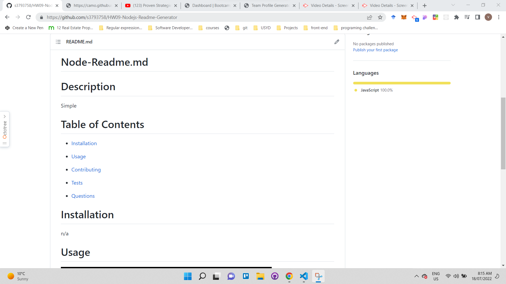

# Portfolio Generator

  

## Introduction

Portfolio Generator is a command-line application that allows the user to input some professional information about themselves in order to generate starter HTML code for a portfolio.

I made this app to learn about `Node.js`, `Inquirer`, and template literals.

## Installation

| Steps                | Details                                                                  |
| -------------------- | ------------------------------------------------------------------------ |
| Install Node.js      | Download it at https://nodejs.org/en/                                    |
| Clone this repo      | ` git clone https://github.com/s3793758/HW09-Nodejs-Readme-Generator.git` |
| Install dependencies | ` npm install`                                                           |

## Usage

| Steps                  | Details                     |
| ---------------------- | --------------------------- |
| Start                  | `npm start`                 |
| Answer the prompts     | `What is your name? {name}` |
| Find the file in dist/ | `cd dist`                   |

## Video Demo

Demo https://drive.google.com/file/d/1S2T7iT92141xUsbSSqC-FdLNSkqaGgvg/view

---

## Screenshots

### Screenshot: Uploaded on Git

### Screenshot: Generated Page

## Credits

-  BCS Resources

## License

&copy; Muhamad Sahid <mas152q@gmail.com>

Licensed under the [MIT License](./LICENSE).
